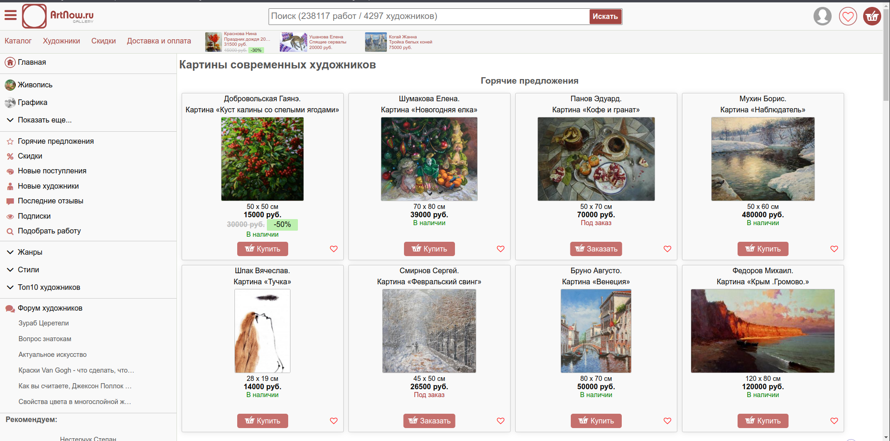

Это выполнение задание по дисциплине "Автоматизирование тестирование".

Тестируемый сайт: https://artnow.ru/

*это выглядит мега печально...*

## Технологии

- Язык программирования – Java 21
- Сборка проектов – Gradle 8.6
- Фреймворк для тестирования – testng (предварительно)
- Репортинг – Allure
- Selenium WebDriver

## Часть 1: создание фреймворка для автоматизированного тестирования GUI

- Создание фреймворка автоматизированного тестирования GUI сайта

*Создать фреймворк для автоматизированного тестирования* GUI сайта "Картины современных художников" (<https://artnow.ru/> ), который должен удовлетворять следующим требованиям:

**1_**. реализует паттерн Layered Architecture Pattern;

**2_**. использует систему отчетности Allure;

**3_**. при фейле теста *делает скриншот экрана*.

**4_**. реализация фреймворка должна вестись *с использованием GIT системы*, результаты работы должны быть *опубликованы в GIT репозитории github / gitlab*.

**5_**. использовать *явные ожидания, если необходимо*.

**6_**. поддерживает *работу с двумя браузерами* Google Chrome, Firefox.

**7_**. реализует паттерн Page Object для страниц сайта.

**8_**. реализует *доступ к обьектам страницы* через CSS или XPath локаторы.

## Часть 2: реализация тестовых сценариев

**1_**. Перейти в “Вышитые картины”, *произвести поиск по жанру* «Городской пейзаж», *проверить*, что картина “Трамвайный путь” *присутствует в выдаче*.

**2_**. Перейти в “Вышитые картины”, *произвести поиск по жанру* «Городской пейзаж», *открыть подробности* картины “Трамвайный путь”, *проверить, что стиль картины* «Реализм».

**3_**. Перейти в “Батик”, *добавить первую картину в избранное*, проверить, что *выбранная картина сохранилась* в разделе «Избранное».

**4_**. *Ввести в поисковую строку* «Жираф», проверить, что *название первой картины содержит слово* «Жираф».

**5_**. Перейти в “Ювелирное искусство”, *добавить первое изделие в корзину*, проверить, что *выбранный товар находится в корзине*, *стоимость товара не изменилась*.

## Критерии оценки

1. Код должен быть *отформатированным, читаемым и задокументированным*.
2. Автотесты должны быть *корректно разделены на тесты и сопутствующие классы*.
3. Каждый тест *проверяет конкретный сценарий и возвращает систему в исходное состояние*.
4. Тесты должны быть *стабильными и должны запускаться параллельно* в 2 или 4 потока.
5. Отчет *allure должен содержать скриншоты*.